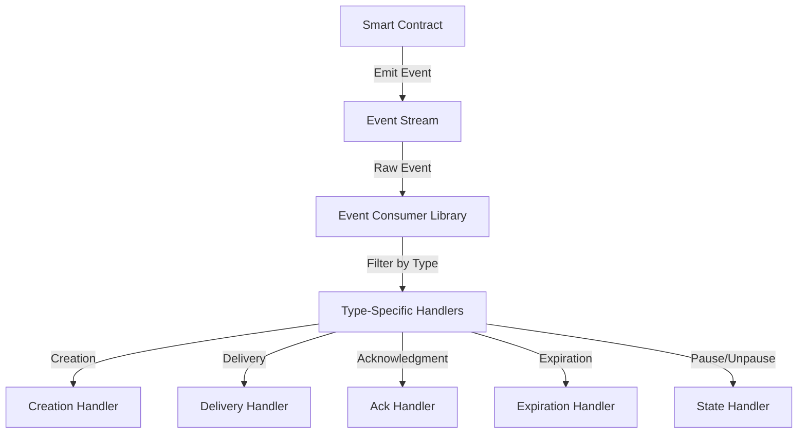

# Design Document: Notification Type Filtering

## Overview

This document defines the technical architecture for adding notification type filtering to the AutoShare smart contract. The feature enables off-chain consumers to identify and filter events by notification type (Creation, Delivery, Acknowledgment, Expiration, Pause, Unpause) without processing irrelevant events.

**Key Goals:**
- Emit metadata identifying the notification type with each event
- Enable efficient filtering of events by type in off-chain consumers
- Maintain backward compatibility with existing event listeners
- Provide a reusable filtering consumer library

---

## Architecture

### High-Level Flow

```
Contract Event Emission
    ↓
Event contains notificationType metadata
    ↓
Off-chain Listener receives event
    ↓
Consumer Library filters by type
    ↓
Type-specific handlers process event
```

### Component Interaction



---

## Components and Interfaces

### 1. Notification Type Enumeration

**File:** `contract/contracts/hello-world/src/base/events.rs`

```rust
/// Represents the classification of an emitted event
#[derive(Clone, Debug, Eq, PartialEq, Serialize, Deserialize)]
#[serde(rename_all = "PascalCase")]
pub enum NotificationType {
    /// Emitted when a notification is created (creation event)
    Creation,
    /// Emitted when a notification is delivered to a recipient
    Delivery,
    /// Emitted when a recipient acknowledges receipt
    Acknowledgment,
    /// Emitted when a notification expires
    Expiration,
    /// Emitted when the contract is paused
    Pause,
    /// Emitted when the contract is unpaused
    Unpause,
}

impl NotificationType {
    /// Returns the string representation of the notification type
    pub fn as_str(&self) -> &'static str {
        match self {
            Self::Creation => "Creation",
            Self::Delivery => "Delivery",
            Self::Acknowledgment => "Acknowledgment",
            Self::Expiration => "Expiration",
            Self::Pause => "Pause",
            Self::Unpause => "Unpause",
        }
    }

    /// Parses a notification type from a string
    pub fn from_str(s: &str) -> Option<Self> {
        match s {
            "Creation" => Some(Self::Creation),
            "Delivery" => Some(Self::Delivery),
            "Acknowledgment" => Some(Self::Acknowledgment),
            "Expiration" => Some(Self::Expiration),
            "Pause" => Some(Self::Pause),
            "Unpause" => Some(Self::Unpause),
            _ => None,
        }
    }

    /// Returns all valid notification types
    pub fn all() -> [Self; 6] {
        [
            Self::Creation,
            Self::Delivery,
            Self::Acknowledgment,
            Self::Expiration,
            Self::Pause,
            Self::Unpause,
        ]
    }
}
```

### 2. Extended Event Structure

**File:** `contract/contracts/hello-world/src/base/events.rs`

```rust
/// Represents an event with notification type metadata
#[derive(Clone, Debug, Serialize, Deserialize)]
pub struct TypedEvent {
    /// The notification type identifying the event category
    pub notification_type: NotificationType,
    /// The timestamp when the event was emitted (block timestamp)
    pub timestamp: u64,
    /// Original event data - can be deserialized based on notification_type
    pub data: String, // JSON-encoded payload
}

impl TypedEvent {
    /// Creates a new typed event with current timestamp
    pub fn new(notification_type: NotificationType, data: String) -> Self {
        Self {
            notification_type,
            timestamp: 0, // Will be set by contract via env.ledger().timestamp()
            data,
        }
    }

    /// Returns the notification type as a string for filtering
    pub fn type_str(&self) -> &'static str {
        self.notification_type.as_str()
    }
}
```

### 3. Event Emission Implementation

The contract will emit events with notification type metadata at key lifecycle points:

**Creation Event:**
```rust
// When schedule_notification is called
pub fn emit_creation_event(env: &Env, notification_id: BytesN<32>, creator: Address) {
    let event_data = serde_json::json!({
        "notification_id": notification_id,
        "creator": creator.to_string(),
    });
    
    let typed_event = TypedEvent {
        notification_type: NotificationType::Creation,
        timestamp: env.ledger().timestamp(),
        data: event_data.to_string(),
    };
    
    env.events().publish(("notification", "created"), typed_event);
}
```

**Delivery Event:**
```rust
pub fn emit_delivery_event(env: &Env, notification_id: BytesN<32>, recipient: Address) {
    let typed_event = TypedEvent {
        notification_type: NotificationType::Delivery,
        timestamp: env.ledger().timestamp(),
        data: serde_json::json!({
            "notification_id": notification_id,
            "recipient": recipient.to_string(),
        }).to_string(),
    };
    
    env.events().publish(("notification", "delivered"), typed_event);
}
```

**Acknowledgment Event:**
```rust
pub fn emit_acknowledgment_event(env: &Env, notification_id: BytesN<32>, recipient: Address) {
    let typed_event = TypedEvent {
        notification_type: NotificationType::Acknowledgment,
        timestamp: env.ledger().timestamp(),
        data: serde_json::json!({
            "notification_id": notification_id,
            "recipient": recipient.to_string(),
        }).to_string(),
    };
    
    env.events().publish(("notification", "acknowledged"), typed_event);
}
```

**Expiration Event:**
```rust
pub fn emit_expiration_event(env: &Env, notification_id: BytesN<32>) {
    let typed_event = TypedEvent {
        notification_type: NotificationType::Expiration,
        timestamp: env.ledger().timestamp(),
        data: serde_json::json!({
            "notification_id": notification_id,
        }).to_string(),
    };
    
    env.events().publish(("notification", "expired"), typed_event);
}
```

**Pause Event:**
```rust
pub fn emit_pause_event(env: &Env, admin: Address) {
    let typed_event = TypedEvent {
        notification_type: NotificationType::Pause,
        timestamp: env.ledger().timestamp(),
        data: serde_json::json!({
            "admin": admin.to_string(),
        }).to_string(),
    };
    
    env.events().publish(("contract", "paused"), typed_event);
}
```

**Unpause Event:**
```rust
pub fn emit_unpause_event(env: &Env, admin: Address) {
    let typed_event = TypedEvent {
        notification_type: NotificationType::Unpause,
        timestamp: env.ledger().timestamp(),
        data: serde_json::json!({
            "admin": admin.to_string(),
        }).to_string(),
    };
    
    env.events().publish(("contract", "unpaused"), typed_event);
}
```

### 4. Consumer Filtering Library

**File:** `consumer-library/src/event_filter.rs` (TypeScript/JavaScript)

```typescript
/**
 * Represents a notification event with type metadata
 */
export interface TypedEvent {
  notification_type: 'Creation' | 'Delivery' | 'Acknowledgment' | 'Expiration' | 'Pause' | 'Unpause';
  timestamp: number;
  data: Record<string, any>;
}

/**
 * Filters an array of events by one or more notification types
 * @param events - Array of events to filter
 * @param types - One or more notification types to match
 * @returns Array of events matching the specified types
 * 
 * Time Complexity: O(n) where n is the number of events
 * Space Complexity: O(m) where m is the number of matching events
 */
export function filterEventsByType(
  events: TypedEvent[],
  types: NotificationType | NotificationType[]
): TypedEvent[] {
  const typeSet = new Set(Array.isArray(types) ? types : [types]);
  return events.filter(event => typeSet.has(event.notification_type));
}

/**
 * Type-specific filter functions for convenience
 */
export const EventFilters = {
  creationEvents: (events: TypedEvent[]) => filterEventsByType(events, 'Creation'),
  deliveryEvents: (events: TypedEvent[]) => filterEventsByType(events, 'Delivery'),
  acknowledgmentEvents: (events: TypedEvent[]) => filterEventsByType(events, 'Acknowledgment'),
  expirationEvents: (events: TypedEvent[]) => filterEventsByType(events, 'Expiration'),
  pauseEvents: (events: TypedEvent[]) => filterEventsByType(events, 'Pause'),
  unpauseEvents: (events: TypedEvent[]) => filterEventsByType(events, 'Unpause'),
  
  // Combined filters
  lifecycleEvents: (events: TypedEvent[]) => 
    filterEventsByType(events, ['Delivery', 'Acknowledgment', 'Expiration']),
  
  stateChangeEvents: (events: TypedEvent[]) => 
    filterEventsByType(events, ['Pause', 'Unpause']),
};

/**
 * Event listener that processes only specific notification types
 */
export class TypedEventListener {
  private handlers: Map<NotificationType, (event: TypedEvent) => void> = new Map();

  /**
   * Register a handler for a specific notification type
   */
  on(type: NotificationType, handler: (event: TypedEvent) => void): void {
    this.handlers.set(type, handler);
  }

  /**
   * Process an event, routing to the appropriate handler
   */
  process(event: TypedEvent): void {
    const handler = this.handlers.get(event.notification_type);
    if (handler) {
      handler(event);
    }
  }

  /**
   * Process multiple events
   */
  processMany(events: TypedEvent[]): void {
    events.forEach(event => this.process(event));
  }
}
```

---

## Data Models

### Event Registry Entry

```rust
pub struct EventRegistryEntry {
    pub id: u64,                              // Sequential event ID
    pub contract_address: String,             // Address of emitting contract
    pub ledger_sequence: u32,                 // Ledger sequence number
    pub event_type: String,                   // Original event type (e.g., "notification")
    pub notification_type: NotificationType,  // NEW: The notification type classification
    pub timestamp: u64,                       // NEW: Block timestamp
    pub topic: Vec<String>,                   // Event topics
    pub value: String,                        // Serialized event value
    pub transaction_hash: String,             // Transaction hash
}
```

### Backward Compatibility

**Old Event Structure (still supported):**
```rust
pub struct Event {
    pub id: u64,
    pub contractAddress: String,
    pub ledger: u32,
    pub type: String,
    pub topic: Vec<String>,
    pub value: String,
    pub txHash: String,
}
```

**New Event Structure (with metadata):**
```rust
pub struct EventWithMetadata {
    // All existing fields remain unchanged
    pub id: u64,
    pub contractAddress: String,
    pub ledger: u32,
    pub type: String,
    pub topic: Vec<String>,
    pub value: String,
    pub txHash: String,
    
    // New fields for filtering
    pub notificationType: String,     // "Creation", "Delivery", etc.
    pub timestamp: u64,               // Block timestamp
}
```

**Deserialization Strategy:**
- `notificationType` field is optional during deserialization
- Existing listeners that don't read this field continue to work
- When present, the field is populated; when absent, defaults to an inferred value or remains null

---

## Correctness Properties

*A property is a characteristic or behavior that should hold true across all valid executions of a system—essentially, a formal statement about what the system should do. Properties serve as the bridge between human-readable specifications and machine-verifiable correctness guarantees.*

### Property 1: Notification Type Metadata Presence

*For any* event emitted from the contract, the event data SHALL contain a notificationType field with a value from the set {Creation, Delivery, Acknowledgment, Expiration, Pause, Unpause}.

**Validates: Requirements 1.1, 1.2**

### Property 2: Single Type per Event

*For any* event emitted from the contract, exactly one notification type value SHALL be assigned (no multi-type events).

**Validates: Requirements 1.4**

### Property 3: Type Preservation on Retrieval

*For any* event that is emitted and then queried/replayed from storage, the notificationType field SHALL remain unchanged.

**Validates: Requirements 1.5**

### Property 4: Schema Includes Notification Type

*For any* event deserialized from the Event Registry, the schema SHALL include the notificationType field without deserialization errors.

**Validates: Requirements 2.1, 2.4**

### Property 5: All New Events Populated

*For any* event created after the feature implementation, the notificationType field SHALL be populated (non-null, non-empty).

**Validates: Requirements 2.2**

### Property 6: Backward Compatibility - Old Field Preservation

*For any* event structure, all existing fields (id, contractAddress, ledger, type, topic, value, txHash) SHALL remain unchanged in name and type.

**Validates: Requirements 2.3, 3.4**

### Property 7: Backward Compatibility - Old Parser Continues

*For any* event and old listener code that ignores notificationType, the listener's core functionality SHALL remain unaffected when processing new events.

**Validates: Requirements 3.1, 3.3**

### Property 8: Old Listeners Receive All Fields

*For any* event queried by pre-feature listeners, the event SHALL include all fields (including notificationType) without errors.

**Validates: Requirements 3.2, 3.5**

### Property 9: Creation Events Correct Type

*For any* call to schedule_notification, the emitted event SHALL have notificationType = "Creation".

**Validates: Requirements 4.1**

### Property 10: Delivery Events Correct Type

*For any* call to confirm_notification_delivery, the emitted event SHALL have notificationType = "Delivery".

**Validates: Requirements 4.2**

### Property 11: Acknowledgment Events Correct Type

*For any* call to acknowledge_notifications, the emitted event SHALL have notificationType = "Acknowledgment".

**Validates: Requirements 4.3**

### Property 12: Expiration Events Correct Type

*For any* call to expire_notification, the emitted event SHALL have notificationType = "Expiration".

**Validates: Requirements 4.4**

### Property 13: Pause Events Correct Type

*For any* call to pause, the emitted event SHALL have notificationType = "Pause".

**Validates: Requirements 4.5**

### Property 14: Unpause Events Correct Type

*For any* call to unpause, the emitted event SHALL have notificationType = "Unpause".

**Validates: Requirements 4.6**

### Property 15: Filter Single Type Returns Matching Events

*For any* event array and single notification type, the filter function SHALL return only events whose notificationType matches the specified type.

**Validates: Requirements 5.2**

### Property 16: Filter Multiple Types Returns Any Match

*For any* event array and multiple notification types, the filter function SHALL return events whose notificationType matches ANY of the specified types.

**Validates: Requirements 5.3**

### Property 17: Filter Empty Array Returns Empty

*For any* filter operation on an empty event array, the filter SHALL return an empty array (edge case).

**Validates: Requirements 5.4**

### Property 18: Filter Partial Match Returns Available Types

*For any* filter operation with multiple requested types where only some are present in the event array, the filter SHALL return events of the types that ARE present (edge case).

**Validates: Requirements 5.5**

### Property 19: Filter Function Interface

*For any* consumer library implementation, the filter function SHALL accept an event array and one or more notification types as parameters.

**Validates: Requirements 5.1**

### Property 20: Filter Time Complexity

*For any* filter operation with n events and m notification types to match, the filtering operation SHALL complete in O(n) time complexity.

**Validates: Requirements 5.6**

---

## Error Handling

### Contract-Level Error Handling

**Invalid Event Emission:**
- Validation: Ensure notificationType is one of the 6 enum values before emission
- Error: Reject event emission if type is invalid
- Message: "Invalid notification type. Must be one of: Creation, Delivery, Acknowledgment, Expiration, Pause, Unpause"

**Missing Event Metadata:**
- Validation: Verify timestamp is populated before emission
- Error: Reject event if timestamp cannot be retrieved
- Message: "Unable to retrieve ledger timestamp for event metadata"

### Consumer Library Error Handling

**Invalid Filter Type:**
```typescript
export function filterEventsByType(events: TypedEvent[], types: any): TypedEvent[] {
  if (!Array.isArray(types) && !isValidNotificationType(types)) {
    throw new Error(`Invalid notification type: ${types}. Must be one of: Creation, Delivery, Acknowledgment, Expiration, Pause, Unpause`);
  }
  
  const typeArray = Array.isArray(types) ? types : [types];
  const invalidTypes = typeArray.filter(t => !isValidNotificationType(t));
  
  if (invalidTypes.length > 0) {
    throw new Error(`Invalid notification types: ${invalidTypes.join(', ')}`);
  }
  
  // ... proceed with filtering
}
```

**Null/Undefined Events:**
```typescript
export function filterEventsByType(events: TypedEvent[] | null, types: NotificationType): TypedEvent[] {
  if (!events || !Array.isArray(events)) {
    throw new Error('Events must be a non-null array');
  }
  
  if (!events.every(e => e && typeof e === 'object' && 'notification_type' in e)) {
    throw new Error('All events must have notification_type property');
  }
  
  return events.filter(event => event.notification_type === types);
}
```

---

## Testing Strategy

### Unit Testing (Contract)

**Notification Type Enum Tests:**
- Verify all 6 types exist and are distinct
- Verify string conversion works bidirectionally (as_str, from_str)
- Test invalid type parsing returns None

**Event Emission Tests:**
- For each notification type, verify the emitted event has correct type value
- Verify timestamp is populated at emission time
- Verify event data can be serialized/deserialized

**Backward Compatibility Tests:**
- Deserialize new events with old parsing logic
- Verify old fields remain accessible
- Verify no errors occur during old listener processing

### Unit Testing (Consumer Library)

**Filter Function Tests:**
- Single type filtering: filter events with one type, verify only matching events returned
- Multiple type filtering: filter with multiple types, verify events matching ANY type returned
- Empty array: filter empty array, verify empty array returned
- Partial matches: filter with types some present and some absent, verify present types returned
- Invalid types: filter with invalid type strings, verify error thrown

**Event Listener Tests:**
- Register handlers for different types
- Process events, verify correct handler called
- Process batch of events, verify all routed correctly

### Property-Based Tests

**Property 1-20 Implementation:**
Each property will be implemented as a property-based test using fast-check (JavaScript) or QuickCheck (Rust equivalent):

**Example Property Test (JavaScript):**
```typescript
import fc from 'fast-check';

describe('Notification Type Filtering', () => {
  // Property 1: All events have notification_type
  it('all emitted events contain notification_type (Property 1)', () => {
    fc.assert(
      fc.property(
        fc.array(arbitraryEvent()),
        (events) => {
          events.forEach(event => {
            expect(['Creation', 'Delivery', 'Acknowledgment', 'Expiration', 'Pause', 'Unpause']).toContain(
              event.notification_type
            );
          });
          return true;
        }
      ),
      { numRuns: 100 }
    );
  });

  // Property 15: Filter single type returns matching events
  it('filter with single type returns only matching events (Property 15)', () => {
    fc.assert(
      fc.property(
        fc.array(arbitraryEvent()),
        fc.oneof(...NOTIFICATION_TYPES.map(fc.constant)),
        (events, filterType) => {
          const filtered = filterEventsByType(events, filterType);
          const allMatch = filtered.every(e => e.notification_type === filterType);
          return allMatch;
        }
      ),
      { numRuns: 100 }
    );
  });

  // Property 17: Filter empty array returns empty
  it('filter empty array returns empty array (Property 17 - edge case)', () => {
    const result = filterEventsByType([], 'Creation');
    expect(result).toEqual([]);
  });
});
```

### Integration Testing

**End-to-End Event Flow:**
1. Trigger contract action (e.g., schedule_notification)
2. Capture emitted event
3. Verify event contains correct notificationType
4. Pass event to consumer library filter
5. Verify filter correctly categorizes event

**Multiple Event Processing:**
1. Trigger multiple contract actions
2. Collect all emitted events
3. Filter by multiple types
4. Verify correct events returned
5. Verify no events missed or duplicated

**Backward Compatibility Verification:**
1. Create events with new structure
2. Run old listener code against new events
3. Verify no errors and correct behavior

### Test Configuration

- **Minimum iterations per property test:** 100
- **Tag format:** `Feature: notification-type-filtering, Property N: [property description]`
- **Coverage target:** 95%+ for new notification type code
- **Test locations:**
  - Rust tests: `contract/contracts/hello-world/tests/notification_type_filtering_test.rs`
  - Consumer library tests: `consumer-library/tests/event_filter.test.ts`

---

## Implementation Approach

### Phase 1: Core Type Definition
1. Define NotificationType enum in `base/events.rs`
2. Extend TypedEvent struct with metadata
3. Add serialization/deserialization support

### Phase 2: Contract Emission
1. Update all event emission points in autoshare_logic.rs
2. Ensure all 6 notification types are emitted at appropriate moments
3. Add timestamp population

### Phase 3: Consumer Library
1. Create event_filter.rs module
2. Implement filter function with O(n) complexity
3. Add type-specific convenience filters
4. Implement TypedEventListener class

### Phase 4: Testing
1. Write property-based tests for all 20 properties
2. Write unit tests for filter function
3. Write integration tests for end-to-end flows
4. Verify backward compatibility

### Phase 5: Documentation
1. Update contract documentation
2. Document consumer library API
3. Provide migration guide for existing listeners

---

## Backward Compatibility Strategy

### Principle: Additive Only

- No existing fields are removed, renamed, or changed in type
- notificationType is added as a new optional field during deserialization
- Existing listeners that don't read the field continue to work unchanged

### Implementation Details

**During Serialization:**
```rust
// New events always include notificationType
pub fn emit_event(env: &Env, notification_type: NotificationType, data: TypedEvent) {
    // Always include the metadata
    env.events().publish(("notification", notification_type.as_str()), data);
}
```

**During Deserialization:**
```rust
// Old code path: existing listeners ignore the extra field
let event: OldEventFormat = serde_json::from_str(event_json)?;
// Works fine - serde ignores unknown fields by default with #[serde(deny_unknown_fields = false)]

// New code path: new listeners can access the metadata
let event: EventWithMetadata = serde_json::from_str(event_json)?;
let notification_type = event.notificationType;
```

### Migration Path

**For Existing Listeners:**
1. No changes required - they continue to work
2. Optionally update to use filtering for improved performance

**For New Listeners:**
1. Use the new TypedEvent structure
2. Apply filtering via consumer library
3. Implement type-specific handlers

### Version Tracking

Track notification type feature readiness using schema versioning:
```rust
// In contract
pub const SCHEMA_VERSION: u32 = 2; // Bump when adding notification_type

// In listener
pub fn can_handle(event: Event) -> bool {
    event.schema_version >= 2
}
```

---

## Security Considerations

### Event Type Validation

- Enum is closed - only 6 valid types exist
- Invalid types cannot be assigned
- Type value is immutable after event creation

### Consumer Library Safety

- Filter function is side-effect free (pure)
- Filter operation cannot modify events
- Filter performance is predictable O(n)

### Access Control

- Event emission requires proper authorization checks in contract
- Consumer library doesn't perform authorization - that's caller's responsibility

---

## Deployment Checklist

- [ ] Add NotificationType enum to base/events.rs
- [ ] Extend event structures with metadata
- [ ] Update all event emission points (6 locations minimum)
- [ ] Implement consumer library filter function
- [ ] Add backward compatibility tests
- [ ] Update event registry schema
- [ ] Deploy with proper version signaling
- [ ] Monitor event streams for correct type assignment
- [ ] Document for off-chain consumers

