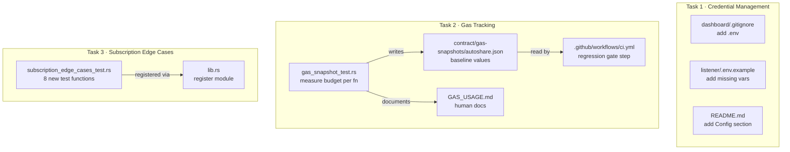
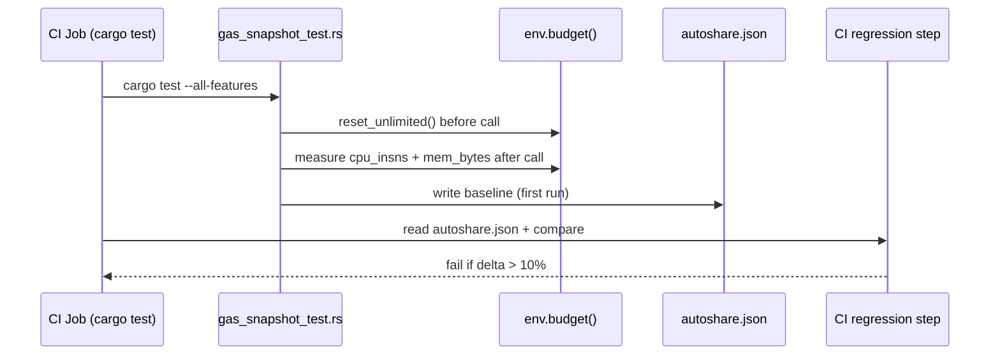
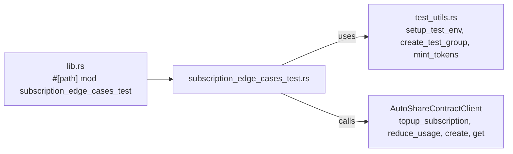

# Design Document: Notify-Chain Improvements

## Overview

This document covers three independent improvements to the Notify-Chain repository:

1. **Task 1 — Secure Credential Management**: Harden the repository against accidental secret leakage by closing a `.gitignore` gap in the dashboard, completing missing entries in `listener/.env.example`, and adding a unified Configuration reference section to the root `README.md`.

2. **Task 2 — Gas Consumption Tracking**: Introduce a reproducible gas-measurement test module for the AutoShare Soroban contract, persist the results as a JSON snapshot file, document human-readable cost figures in `GAS_USAGE.md`, and add a CI gate that fails when any function regresses beyond 10 % of its baseline.

3. **Task 3 — Subscription Edge-Case Tests**: Expand the Rust test suite for the `topup_subscription` and `reduce_usage` functions to cover the eight missing edge cases identified during review, and register the new test module in `lib.rs`.

Each task is self-contained and can be committed to its own branch independently.

---

## Architecture



---

## Components and Interfaces

See per-task subsections below.

## Data Models

See per-task subsections below.

## Error Handling

See per-task subsections below.

## Testing Strategy

See per-task subsections below.

---

## Task 1 — Secure Credential Management

### Components and Interfaces

#### Component: `dashboard/.gitignore`

**Purpose**: Prevent the dashboard's `.env` file from being committed.

**Change**: Append `.env` to the existing ignore list.

**Current state**:
```
node_modules
dist
.DS_Store
```

**Target state** (additions only):
```
.env
.env.local
.env.*.local
```

#### Component: `listener/.env.example`

**Purpose**: Document every environment variable the listener reads so operators can configure a new deployment without reading source code.

**Missing variables** (identified by diffing `config.ts` against `.env.example`):

| Variable | Type | Default | Description |
|---|---|---|---|
| `DISCORD_WEBHOOK_ID` | string | — | The numeric ID portion of the Discord webhook URL; required when `DISCORD_WEBHOOK_URL` is set |
| `RATE_LIMIT_ENABLED` | boolean | `true` | Set to `false` to disable the API rate limiter |
| `RATE_LIMIT_WINDOW_MS` | integer | `60000` | Rolling window length for rate-limit counting (ms) |
| `RATE_LIMIT_MAX_REQUESTS` | integer | `60` | Max requests per client within the window |
| `RATE_LIMIT_CLIENT_OVERRIDES` | JSON object | `{}` | Per-client rate-limit overrides, keyed by client ID |

These are already parsed by `loadConfig()` in `listener/src/config.ts`; the example file simply lacks corresponding documentation entries.

#### Component: `README.md` (root)

**Purpose**: Provide a single, authoritative reference for all environment variables so contributors do not need to read source files.

**New section**: `## Configuration / Environment Variables`

The section will contain two sub-sections:

- **Listener (`listener/.env`)** — all variables from `listener/.env.example` with type, default, and description
- **Dashboard (`dashboard/.env`)** — all variables from `dashboard/.env.example` with type, default, and description

### Data Models

No new data structures are introduced. The change is purely to non-code files.

### Error Handling

Not applicable — these are documentation and configuration changes.

### Testing Strategy

**Unit Testing Approach**: Not applicable for `.gitignore` and `.env.example` edits.

**Property-Based Testing Approach**: Not applicable.

**Integration Testing Approach**: Manual smoke-test by verifying `git status` does not surface a created `.env` file in the dashboard directory after the `.gitignore` change is applied.

---

## Task 2 — Gas Consumption Tracking

### Architecture



### Components and Interfaces

#### Component: `gas_snapshot_test.rs`

**Purpose**: Measure and assert Soroban budget consumption for each critical function under representative inputs.

**Location**: `contract/contracts/hello-world/src/tests/gas_snapshot_test.rs`

**Key functions measured**:

```rust
// Pseudocode — actual Soroban testutils API
fn measure_budget(env: &Env, call: impl FnOnce()) -> BudgetSnapshot {
    env.budget().reset_unlimited();
    call();
    BudgetSnapshot {
        cpu_insns: env.budget().cpu_insns_consumed(),
        mem_bytes: env.budget().mem_bytes_consumed(),
    }
}
```

Each test function follows this pattern:

```rust
#[test]
fn snapshot_create() {
    let test_env = setup_test_env();
    let token = test_env.mock_tokens.get(0).unwrap();
    let creator = test_env.users.get(0).unwrap();
    mint_tokens(&test_env.env, &token, &creator, 10_000_000);

    test_env.env.budget().reset_unlimited();
    let client = AutoShareContractClient::new(&test_env.env, &test_env.autoshare_contract);
    client.create(&id, &name, &creator, &10u32, &token);

    let cpu = test_env.env.budget().cpu_insns_consumed();
    let mem = test_env.env.budget().mem_bytes_consumed();

    // Assert values are non-zero and within plausible range
    assert!(cpu > 0);
    assert!(mem > 0);
    // Print for snapshot capture: println!("create: cpu={cpu}, mem={mem}");
}
```

Functions covered:
- `create` — baseline: 1 group, 10 usages, mock token, no members yet
- `topup_subscription` — baseline: existing group, 10 additional usages, same payer
- `update_members` — baseline: group with 3 members replacing existing empty list
- `withdraw` — baseline: admin withdraws 100 tokens to recipient

#### Component: `contract/gas-snapshots/autoshare.json`

**Purpose**: Machine-readable baseline that the CI regression gate reads.

**Schema**:

```json
{
  "version": 1,
  "functions": {
    "create": {
      "cpu_insns": 0,
      "mem_bytes": 0,
      "description": "Create a new AutoShare group (10 usages, no members)"
    },
    "topup_subscription": {
      "cpu_insns": 0,
      "mem_bytes": 0,
      "description": "Top up existing group with 10 additional usages"
    },
    "update_members": {
      "cpu_insns": 0,
      "mem_bytes": 0,
      "description": "Set 3 members with equal percentage split"
    },
    "withdraw": {
      "cpu_insns": 0,
      "mem_bytes": 0,
      "description": "Admin withdraws 100 tokens"
    }
  }
}
```

Values are initialised to `0` in the committed skeleton; the first successful CI run (or a local `cargo test -- --nocapture` run) populates them with real measurements that are then committed.

#### Component: `GAS_USAGE.md`

**Purpose**: Human-readable explanation of what each function costs and how to interpret or update snapshots.

**Sections**:
- Overview of Soroban resource metering
- Table of function baselines (populated after first measurement run)
- How to update the snapshot (`cargo test gas_snapshot`)
- CI regression policy (10 % tolerance)

#### Component: CI regression gate

**Purpose**: Detect performance regressions before merge.

**Mechanism**: After the existing `cargo test` step, add a new step that:
1. Re-runs only the gas snapshot tests with `-- --nocapture` to capture printed measurements
2. Parses the output lines (format: `FUNCTION: cpu=NNN mem=NNN`)
3. Compares against `autoshare.json` baselines
4. Exits non-zero if any metric exceeds `baseline * 1.10`

The step uses a small inline shell script (no external action required) that reads the JSON with `jq` and performs integer arithmetic.

```yaml
- name: Gas regression check
  working-directory: contract
  run: |
    output=$(cargo test --all-features gas_snapshot -- --nocapture 2>&1)
    echo "$output"
    baseline=$(cat contracts/hello-world/gas-snapshots/autoshare.json)
    # parse and compare using jq + awk
    # exit 1 if any function exceeds 110% of baseline
```

### Data Models

```
BudgetSnapshot {
    cpu_insns: u64,
    mem_bytes: u64,
}
```

This is an ephemeral struct used only within the test module — it is never stored on-chain.

### Error Handling

- If the snapshot JSON is malformed, `jq` will exit non-zero and the CI step will fail with a clear parse error.
- If the snapshot file is missing, the gate step skips comparison and emits a warning (does not fail — first-run scenario).

### Testing Strategy

**Unit Testing Approach**: Each snapshot test asserts that `cpu_insns > 0` and `mem_bytes > 0`, acting as a sanity check that measurement is working.

**Property-Based Testing Approach**: Not applicable — gas measurement is deterministic for a given input, so PBT adds no value here.

**Integration Testing Approach**: The CI gate is itself an integration test between the test output and the baseline JSON.

---

## Task 3 — Subscription Edge-Case Tests

### Architecture

All new tests live in a single new file and are registered in the existing `lib.rs` `tests` module block. No production code changes are required — the edge cases exercise existing contract logic.



### Components and Interfaces

#### Component: `subscription_edge_cases_test.rs`

**Purpose**: Cover the eight missing edge cases for subscription lifecycle.

**Location**: `contract/contracts/hello-world/src/tests/subscription_edge_cases_test.rs`

**Test inventory**:

| # | Test name | Expected behaviour | Error variant |
|---|---|---|---|
| 1 | `test_duplicate_create_error_type` | `create` with same ID panics with `AlreadyExists` | `Error::AlreadyExists` |
| 2 | `test_topup_nonexistent_group` | `topup_subscription` on unknown ID panics | `Error::NotFound` |
| 3 | `test_topup_inactive_group_succeeds` | `topup_subscription` on deactivated group **succeeds**; `usage_count` and `total_usages_paid` both increase | — |
| 4 | `test_multiple_sequential_topups` | Three consecutive topups accumulate correctly in `usage_count` and `total_usages_paid` | — |
| 5 | `test_reduce_to_zero_then_reduce_again` | `reduce_usage` N times to reach zero, next call panics | `Error::NoUsagesRemaining` |
| 6 | `test_large_usage_count` | `topup_subscription` with 10 000 usages; verify arithmetic exact | — |
| 7 | `test_topup_different_payer` | Third-party address (not the creator) successfully tops up | — |
| 8 | `test_topup_insufficient_balance` | Payer has 0 tokens; call panics with token transfer failure | token panic |

**Key design decisions**:

- **Test 3 (inactive group topup)**: The `topup_subscription` logic in `autoshare_logic.rs` does **not** check `is_active` — it only checks that the group exists. Therefore, topping up a deactivated group succeeds. The test must verify this is intentional by asserting the state after the call.

- **Test 5 (reduce to zero then again)**: Uses `reduce_usage` N times in a loop (N = initial `usage_count`), then asserts the (N+1)-th call panics. The `#[should_panic]` attribute applies to the final call.

- **Test 8 (insufficient balance)**: Does not mint any tokens for the payer before calling `topup_subscription`. The MockToken `transfer` will panic when the sender has insufficient balance.

**Pattern for each test** (following repo conventions):

```rust
use crate::test_utils::{create_test_group, mint_tokens, setup_test_env};
use crate::AutoShareContractClient;
use soroban_sdk::{testutils::Address as _, Address, BytesN};

#[test]
fn test_topup_inactive_group_succeeds() {
    let test_env = setup_test_env();
    let client = AutoShareContractClient::new(&test_env.env, &test_env.autoshare_contract);
    let creator = test_env.users.get(0).unwrap().clone();
    let token = test_env.mock_tokens.get(0).unwrap().clone();

    let id = create_test_group(&test_env.env, &test_env.autoshare_contract, &creator, 
                               &soroban_sdk::Vec::new(&test_env.env), 5, &token);
    client.deactivate_group(&id, &creator);
    assert!(!client.is_group_active(&id));

    // top up from the same creator (has balance from create_test_group)
    mint_tokens(&test_env.env, &token, &creator, 1000);
    client.topup_subscription(&id, &10u32, &token, &creator);

    let details = client.get(&id);
    assert_eq!(details.usage_count, 15);
    assert_eq!(details.total_usages_paid, 15);
    assert!(!client.is_group_active(&id)); // still inactive
}
```

#### Component: `lib.rs` (registration)

Add to the `mod tests` block:

```rust
#[path = "../tests/subscription_edge_cases_test.rs"]
mod subscription_edge_cases_test;
```

### Data Models

No new data structures. Tests use `AutoShareDetails` fields `usage_count` and `total_usages_paid` directly.

### Error Handling

Tests rely on Soroban's `#[should_panic]` attribute. Where possible, test names and comments call out the specific `Error` variant expected (e.g., `NotFound`, `NoUsagesRemaining`) so future developers can tighten assertions if the SDK exposes typed panic matching.

### Testing Strategy

**Unit Testing Approach**: Each test is a `#[test]` function that exercises one scenario. Success tests use direct `assert_eq!` / `assert!` on retrieved state. Panic tests use `#[should_panic]`.

**Property-Based Testing Approach**: Not applicable — the scenarios are specific boundary conditions, not universal properties across arbitrary inputs.

**Integration Testing Approach**: The new tests are integrated into the existing `cargo test --workspace --all-features` invocation in CI with no CI changes needed for this task.

---

## Correctness Properties

*A property is a characteristic or behavior that should hold true across all valid executions of a system — essentially, a formal statement about what the system should do. Properties serve as the bridge between human-readable specifications and machine-verifiable correctness guarantees.*

### Property 1: Topup accumulates usage counts correctly

For any existing group with initial `usage_count = U` and `total_usages_paid = P`, after calling `topup_subscription` with `additional_usages = N`, the group's `usage_count` becomes `U + N` and `total_usages_paid` becomes `P + N`.

**Validates: Requirements 11.2, 11.3, 13.3, 13.4**

### Property 2: Topup succeeds regardless of group active status

For any existing group (whether active or inactive), `topup_subscription` with a valid token and sufficient payer balance succeeds and updates `usage_count` and `total_usages_paid`.

**Validates: Requirements 10.2, 10.3, 10.4, 10.5**

### Property 3: reduce_usage terminates at zero

For any group with `usage_count = N`, after exactly N calls to `reduce_usage` the count reaches zero, and the (N+1)-th call raises `NoUsagesRemaining`.

**Validates: Requirements 12.2, 12.3**

### Property 4: Gas baselines are non-trivially positive

For any measured contract function, `cpu_insns > 0` and `mem_bytes > 0` after a successful call, confirming the budget measurement is operational.

**Validates: Requirements 4.6**

### Property 5: Snapshot regression is bounded

For any contract function whose baseline is recorded in `autoshare.json`, re-measuring on the same code produces a value within 110 % of the stored baseline.

**Validates: Requirements 6.2, 6.3**
