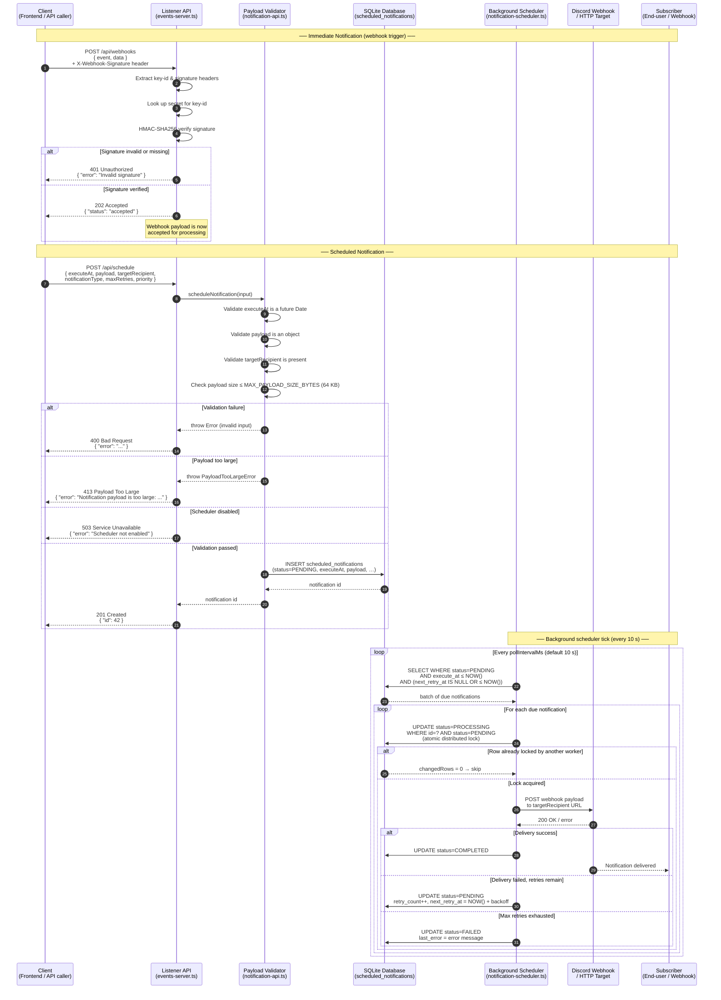
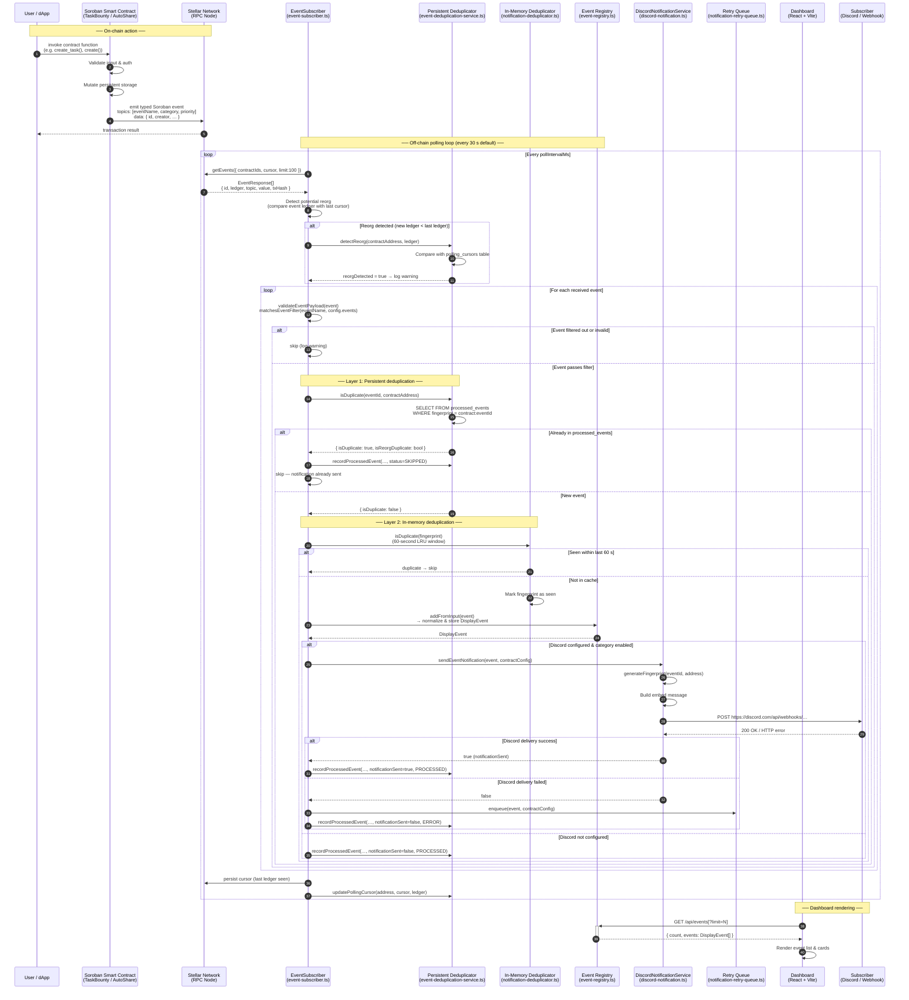
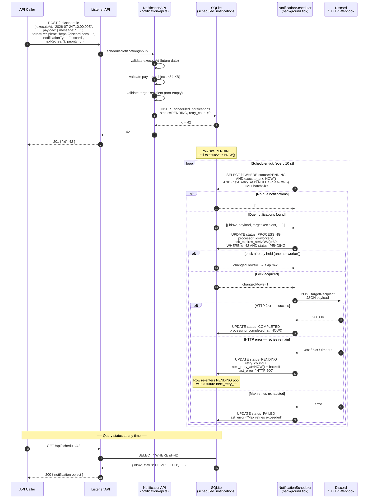
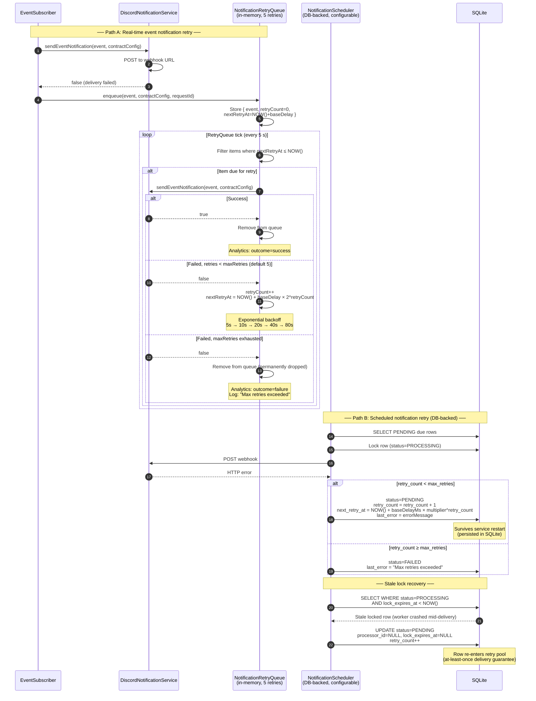
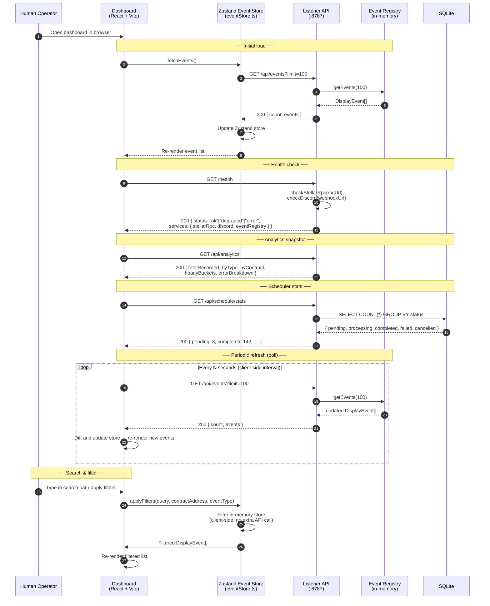

# NotifyChain — API & Notification Sequence Diagrams

> **Issue #354** — Visual reference for contributors who want to understand
> exactly how notifications flow through the system before reading the code.
>
> **Related docs:**
> - [Architecture Overview](ARCHITECTURE_OVERVIEW.md) — layer-by-layer system guide
> - [Notification Failure Recovery](NOTIFICATION_FAILURE_RECOVERY.md) — retry semantics
> - [Scheduled Notifications Delivery](SCHEDULED-NOTIFICATIONS-DELIVERY.md) — delivery guarantees
> - [Listener API Reference](listener/API.md) — endpoint specification
> - [Reorg Deduplication Monitoring](REORG-DEDUPLICATION-MONITORING.md) — duplicate-detection ops

---

## Table of Contents

1. [Diagram 1 — Notification Request Flow](#diagram-1--notification-request-flow)
2. [Diagram 2 — Event Processing Lifecycle](#diagram-2--event-processing-lifecycle)
3. [Diagram 3 — Scheduled Notification Delivery](#diagram-3--scheduled-notification-delivery)
4. [Diagram 4 — Retry & Failure Recovery](#diagram-4--retry--failure-recovery)
5. [Diagram 5 — Dashboard Data Fetch](#diagram-5--dashboard-data-fetch)
6. [Actor Reference](#actor-reference)

---

## Diagram 1 — Notification Request Flow

**What this shows:** How an external client (a frontend app, CI job, or
script) submits a notification payload to the Listener Service, how the
backend validates it, and how it eventually reaches the subscriber.

The flow divides into two sub-paths depending on whether the notification
is *immediate* (sent right now) or *scheduled* (delivered at a future
`executeAt` timestamp).

### Key points

- **Webhook verification** uses HMAC-SHA256 with pre-shared secrets
  configured via `WEBHOOK_SECRETS`. If no secrets are configured every
  webhook call returns `401`.
- **Payload size** is validated before any database write.  The default
  ceiling is **64 KB** (configurable via `MAX_PAYLOAD_SIZE_BYTES`).
- **Distributed lock** prevents two scheduler workers from processing the
  same notification simultaneously. The `WHERE status = 'PENDING'`
  predicate is the atomicity boundary.
- **Exponential backoff** doubles the retry delay at each attempt.
  `RETRY_BASE_DELAY_MS` (default 5 s) × `RETRY_MULTIPLIER` (default 2)
  up to `RETRY_MAX_DELAY_MS` (default 1 h).

---

## Diagram 2 — Event Processing Lifecycle

**What this shows:** The on-chain → off-chain path: how a contract state
change on the Stellar network becomes a notification delivered to a
subscriber and an entry visible in the dashboard.

### Key points

- **Two deduplication layers** work in series. The persistent layer
  (`EventDeduplicationService` + SQLite `processed_events` table) catches
  duplicates across restarts and blockchain reorgs. The in-memory layer
  (`NotificationDeduplicator` LRU cache) catches rapid duplicates cheaply
  without a database round-trip.
- **Reorg detection** compares the incoming event's ledger number against
  the last-known cursor stored in `polling_cursors`. A decreasing ledger
  signals a reorganization.
- **Event Registry** is the in-memory store exposed by `GET /api/events`.
  The dashboard polls it; it is NOT the source of truth — SQLite is.
- **Analytics** are recorded by `NotificationAnalyticsAggregator` for
  every outcome (success, failure, skipped, retry), viewable at
  `GET /api/analytics`.

---

## Diagram 3 — Scheduled Notification Delivery

**What this shows:** The lifecycle of a notification from its creation via
`POST /api/schedule` through to delivery and terminal state, including the
distributed-lock handshake that makes multi-instance deployments safe.

### Notification states

| State | Meaning |
|-------|---------|
| `PENDING` | Waiting for `executeAt` to arrive (or `next_retry_at` to clear). |
| `PROCESSING` | Locked by a worker; delivery in progress. Lock expires after 60 s. |
| `COMPLETED` | Delivered successfully. |
| `FAILED` | Max retries exhausted or unrecoverable error. |
| `CANCELLED` | Explicitly cancelled via API before delivery. |

---

## Diagram 4 — Retry & Failure Recovery

**What this shows:** What happens when a Discord notification fails — both
the in-process `NotificationRetryQueue` path (for real-time event
notifications) and the persistent scheduler retry path (for scheduled
notifications).

### Key points

- **Two independent retry systems** exist. `NotificationRetryQueue` handles
  real-time event notifications in memory (no persistence across restarts).
  `NotificationScheduler` handles scheduled notifications with full
  SQLite persistence and distributed locking.
- **Stale lock recovery** runs each scheduler tick. A lock is stale if
  `lock_expires_at < NOW()` and status is still `PROCESSING`. This
  catches crashes mid-delivery and re-queues the row.
- **At-least-once guarantee**: the DB write completes before the delivery
  attempt is considered definitive. If the process crashes after delivery
  but before marking COMPLETED, the row will be retried — the subscriber
  must be idempotent.

---

## Diagram 5 — Dashboard Data Fetch

**What this shows:** How the React dashboard reads data from the Listener
API, including the events feed, analytics, and scheduler stats.

### Key points

- The dashboard is **strictly read-only**. It never writes to the Listener
  API or to any contract.
- All **search and filtering** happens client-side over the already-fetched
  event array; no extra API calls are needed per keystroke.
- The **health endpoint** (`GET /health`) aggregates Stellar RPC reachability
  and Discord webhook status. It returns `503` if the Stellar RPC is
  unreachable.
- **Rate limiting** is enforced by the Listener API (default 60 req/min per
  client). Dashboard polling intervals should respect this budget.

---

## Actor Reference

| Actor | Code location | Description |
|-------|---------------|-------------|
| **Client** | Any HTTP caller | Frontend, CI job, or script calling the Listener REST API |
| **Listener API** | `listener/src/api/events-server.ts` | Node.js HTTP server handling all REST endpoints |
| **Payload Validator** | `listener/src/services/notification-api.ts`, `listener/src/utils/payload-size-validator.ts` | Validates `executeAt`, `payload`, `targetRecipient`, and payload byte size |
| **SQLite Database** | `listener/src/database/` | Persists scheduled notifications, processed events, templates, rate-limit events |
| **EventSubscriber** | `listener/src/services/event-subscriber.ts` | Polls Stellar RPC for contract events on a configurable interval |
| **Persistent Deduplicator** | `listener/src/services/event-deduplication-service.ts` | Checks `processed_events` table; detects blockchain reorgs |
| **In-Memory Deduplicator** | `listener/src/services/notification-deduplicator.ts` | LRU cache (60 s window) for rapid duplicate suppression |
| **Event Registry** | `listener/src/store/event-registry.ts` | In-memory ring buffer of recent `DisplayEvent` objects; source for `GET /api/events` |
| **DiscordNotificationService** | `listener/src/services/discord-notification.ts` | Formats events as Discord embeds and POSTs to the webhook URL |
| **NotificationRetryQueue** | `listener/src/services/notification-retry-queue.ts` | In-memory retry queue for failed real-time event notifications |
| **NotificationScheduler** | `listener/src/services/notification-scheduler.ts` | Background tick that processes due `scheduled_notifications` rows |
| **Soroban Contract** | `contract/contracts/hello-world/`, `Documents/Task Bounty/` | On-chain Rust/Soroban contracts that emit typed events |
| **Stellar Network** | External | Stellar RPC node returning event streams via `getEvents()` |
| **Dashboard** | `dashboard/src/` | React + Vite SPA; read-only consumer of the Listener API |
| **Subscriber** | External | Discord channel, webhook target, or any HTTP endpoint receiving notifications |

---

*Diagrams reflect the codebase as of 2026-07-23. Maintained as part of issue #354.*
