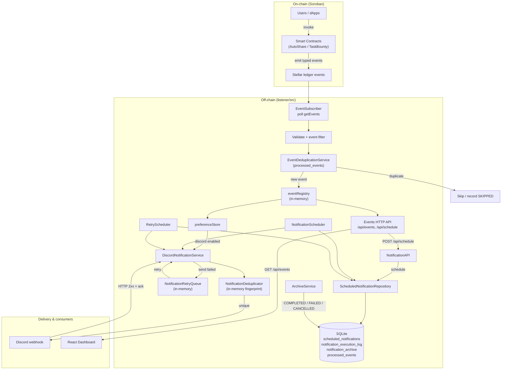
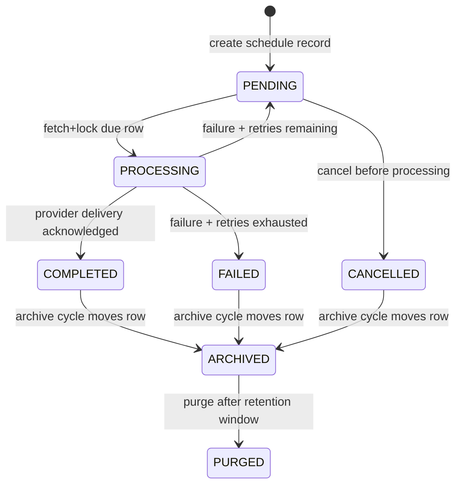
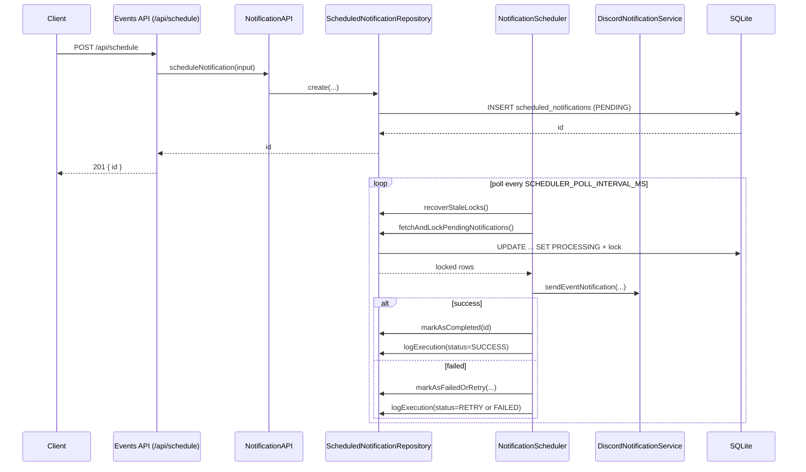

# Notification Lifecycle

> **Canonical documentation** for how Notify-Chain turns on-chain contract events
> into off-chain deliveries, acknowledgments, retries, and archival.
>
> Code paths referenced here live under `listener/src/`. For on-chain event shapes
> and topic layouts, see [CONTRACT_EVENT_REFERENCE.md](CONTRACT_EVENT_REFERENCE.md).
> For retry configuration and failure recovery, see
> [NOTIFICATION_FAILURE_RECOVERY.md](NOTIFICATION_FAILURE_RECOVERY.md).

This document covers:

1. End-to-end step-by-step lifecycle (event detection → delivery → ack/archive)
2. On-chain vs off-chain flow
3. Roles of each system component
4. The durable scheduled-notification path (API / SQLite)
5. Acknowledgment, retry, and archival semantics

---

## Table of Contents

1. [High-Level Overview](#high-level-overview)
2. [Full Cross-Layer Flow (Diagram)](#full-cross-layer-flow-diagram)
3. [On-Chain Flow](#on-chain-flow)
4. [Off-Chain Flow — Real-Time Path](#off-chain-flow--real-time-path)
5. [Off-Chain Flow — Scheduled Path](#off-chain-flow--scheduled-path)
6. [Component Roles](#component-roles)
7. [Acknowledgment](#acknowledgment)
8. [Retry and Failure Handling](#retry-and-failure-handling)
9. [Completion and Archival](#completion-and-archival)
10. [Dashboard Visibility](#dashboard-visibility)
11. [Developer Notes](#developer-notes)
12. [Troubleshooting](#troubleshooting)

---

## High-Level Overview

Notify-Chain has **two delivery paths** that share Discord delivery and
preferences, but differ in durability:

| Path | Trigger | Durability | Primary code |
|------|---------|------------|--------------|
| **Real-time (event-driven)** | Contract event polled from Stellar RPC | In-memory registry + optional in-memory retry; persistent event dedup in SQLite | `EventSubscriber` → `DiscordNotificationService` |
| **Scheduled (durable)** | `POST /api/schedule` or `NotificationAPI.scheduleNotification()` | SQLite `scheduled_notifications` + execution log + archive | `NotificationScheduler` / `RetryScheduler` / `ArchiveService` |

Real-time path is the default reaction to blockchain activity. Scheduled path is
used for deferred or manually scheduled deliveries.

---

## Full Cross-Layer Flow (Diagram)

End-to-end flow from contract emission through listener delivery, provider
acknowledgment, and (for scheduled rows) archival:



Scheduled-notification state machine (durable path only):



---

## On-Chain Flow

1. A user or dApp **invokes** a Soroban contract method (AutoShare, TaskBounty, or
   notification-scheduling helpers on-chain).
2. The contract updates state and **emits a typed event** via the Soroban event
   system (topics + data). Examples: `AutoshareCreated`, `TaskCreated`,
   `NotificationScheduled`, `NotificationExpired`.
3. Events are recorded on the **Stellar ledger**. They are not delivered to Discord
   or the dashboard by the contract itself — the off-chain listener must observe them.
4. Event names, topic layouts, categories, and priorities are documented in
   [CONTRACT_EVENT_REFERENCE.md](CONTRACT_EVENT_REFERENCE.md) (including the
   [Notification Lifecycle Events](CONTRACT_EVENT_REFERENCE.md#notification-lifecycle-events)
   section for on-chain schedule/expire/cancel/revoke events).

**Important:** On-chain `NotificationScheduled` (and related) events are
**ledger signals**. The listener treats them like other contract events for the
real-time path (registry + optional Discord). They do **not** automatically insert
rows into `scheduled_notifications`. Durable off-chain scheduling uses the HTTP /
`NotificationAPI` path below.

---

## Off-Chain Flow — Real-Time Path

Step-by-step from detection to delivery acknowledgment
(`listener/src/services/event-subscriber.ts`):

### 1. Poll Stellar RPC

`EventSubscriber` loops on `pollIntervalMs`, calling `server.getEvents()` per
configured contract address, using a per-contract **cursor** when available
(otherwise `startLedger: 1`).

### 2. Filter and validate

For each event:

- `validateEventPayload()` — drop malformed payloads
- `matchesEventFilter(eventName, contractConfig.events)` — honor per-contract
  event allowlists

### 3. Persistent event deduplication

If `EventDeduplicationService` is wired:

- Optional **reorg detection** via ledger vs stored polling cursor
- `isDuplicate(event.id, contractAddress)` against `processed_events`
- Duplicates are recorded as `SKIPPED` and not re-notified

### 4. Optional processing queue

If `config.eventQueue` is set, events are enqueued to `EventProcessingQueue`;
otherwise `processEvent()` runs inline.

### 5. Register for the events API / dashboard

`eventRegistry.addFromInput(...)` stores a display event in memory (with TTL /
cleanup when configured). This is what `GET /api/events` serves to the dashboard.

### 6. Preference gate

Before Discord send, `preferenceStore.isCategoryEnabled(userId, 'discord')` is
checked (`userId` from `contractConfig.userId` or `'global'`). Disabled categories
skip delivery but the event remains in the registry.

### 7. Discord delivery

`DiscordNotificationService.sendEventNotification()`:

1. Builds a fingerprint `(eventId, contractAddress)` via `NotificationDeduplicator`
2. Skips if already sent within the in-memory dedup window (returns success)
3. Formats a Discord embed and POSTs the webhook
4. Treats `response.ok` as **delivery acknowledgment**
5. On success, marks the fingerprint as sent

### 8. Immediate failure → in-memory retry

If the initial Discord send returns `false`, `NotificationRetryQueue` enqueues the
event for exponential-backoff retries (separate from DB-backed scheduled retries).

### 9. Record processed event

`EventDeduplicationService.recordProcessedEvent(...)` persists processing outcome
(`PROCESSED` / `ERROR`, whether notification was sent).

---

## Off-Chain Flow — Scheduled Path

Durable deferred deliveries (independent of the real-time subscriber path).

### 1. Creation

Entrypoints:

- `POST /api/schedule` in `listener/src/api/events-server.ts`
- `NotificationAPI.scheduleNotification()` in `listener/src/services/notification-api.ts`

Required fields: `executeAt`, `payload`, `targetRecipient`.

Optional: `notificationType` (default `discord`), `maxRetries`, `priority`,
`eventId`, `contractAddress`, `metadata`.

Validation: `executeAt` must be a valid **future** `Date`; `payload` must be an
object; `targetRecipient` required. Failures throw — no DB row is created.

Optional idempotency via `IdempotencyKeyService` when initialized with a key.

Example:

```json
{
  "payload": {
    "event": { "id": "evt_123" },
    "contractConfig": { "address": "CA..." }
  },
  "notificationType": "discord",
  "targetRecipient": "https://discord.com/api/webhooks/...",
  "executeAt": "2026-07-01T09:00:00.000Z",
  "maxRetries": 3,
  "priority": 5,
  "eventId": "evt_123",
  "contractAddress": "CA...",
  "metadata": { "source": "manual" }
}
```

### 2. Persist as PENDING

`ScheduledNotificationRepository.create()` inserts into `scheduled_notifications`
with status `PENDING`.

### 3. Scheduler poll / lock

`NotificationScheduler` (when `SCHEDULER_ENABLED`):

1. `recoverStaleLocks()` — expired `PROCESSING` locks → `PENDING` or `FAILED`
2. `fetchAndLockPendingNotifications()` — due rows (`execute_at <= now`) locked with
   `status=PROCESSING`, `processor_id`, `lock_expires_at`
3. Batch payload validation via `BatchValidationService` / `BatchValidator`

### 4. Execute delivery

For `notificationType === discord`, calls
`DiscordNotificationService.sendEventNotification(...)`.

Declared but not implemented in the scheduler today: `webhook`, `email`, `sms`.

### 5. Outcome

| Result | Status / log |
|--------|----------------|
| Provider ack (`response.ok`) | `COMPLETED` + execution log `SUCCESS` |
| Failure, retries left | back to `PENDING` + log `RETRY` |
| Failure, retries exhausted | `FAILED` + log `FAILED` |

### 6. Delayed retries

`RetryScheduler` picks rows where `status = PENDING`, `retry_count > 0`, and
`next_retry_at` is due. Backoff uses
`calculateBackoffDelay(attempt, baseDelayMs, multiplier, maxDelayMs, jitter)`.

### 7. Archive / purge

Terminal rows (`COMPLETED`, `FAILED`, `CANCELLED`) are later moved by
`ArchiveService` into `notification_archive`, then optionally purged after
retention. See [Completion and Archival](#completion-and-archival).

Sequence (scheduled path):



---

## Component Roles

| Component | Layer | Role |
|-----------|-------|------|
| **Smart contracts** (`contract/`, Task Bounty) | On-chain | Business logic; emit typed Soroban events that the listener observes |
| **EventSubscriber** | Off-chain | Polls Stellar RPC, filters events, drives registry + Discord, owns reconnect/cursor |
| **EventDeduplicationService** | Off-chain | Persistent `(event_id, contract_address)` dedup + reorg/cursor helpers (`processed_events`) |
| **NotificationDeduplicator** | Off-chain | Short-window in-memory fingerprint dedup inside Discord sends |
| **eventRegistry** | Off-chain | In-memory event feed for `GET /api/events` |
| **preferenceStore** | Off-chain | Per-user category gates (e.g. disable Discord) |
| **DiscordNotificationService** | Off-chain | Formats embeds, POSTs webhook, interprets HTTP ack, local retry loop |
| **NotificationRetryQueue** | Off-chain | In-memory exponential backoff for real-time Discord failures |
| **NotificationAPI** + **/api/schedule** | Off-chain | Validates and creates durable scheduled notifications |
| **NotificationScheduler** | Off-chain | Polls due `PENDING` rows, locks, delivers, marks complete/retry/fail |
| **RetryScheduler** | Off-chain | Processes delayed durable retries (`next_retry_at`) |
| **ArchiveService** / **ArchiveStore** | Off-chain | Moves terminal scheduled rows to archive; purges after retention |
| **WorkerManager** | Off-chain | Coordinates graceful shutdown of background workers |
| **Dashboard** (`dashboard/`) | UI | Polls `/api/events` (and related health/search APIs) to show activity |

---

## Acknowledgment

Acknowledgment is **provider-based**, not end-user/manual.

1. **Provider HTTP acknowledgment** — `DiscordNotificationService` / `sendWebhook()`:
   `response.ok === true` means delivered. Scheduler marks `COMPLETED` and logs
   `SUCCESS`.
2. **Provider failure** — non-2xx or transport error → real-time path may enqueue
   `NotificationRetryQueue`; scheduled path uses `markAsFailedOrRetry()` and logs
   `RETRY` / `FAILED`.

Not implemented: no `POST /api/notifications/:id/ack` (or similar) for downstream
consumer acknowledgment.

---

## Retry and Failure Handling

### Scheduled (durable)

- `markAsFailedOrRetry()` increments `retry_count`
- Retries remaining → `PENDING` with `next_retry_at`
- Exhausted → `FAILED` + `processing_completed_at`
- `recoverStaleLocks()` returns expired `PROCESSING` to `PENDING` / `FAILED`

### Real-time (in-memory)

- `NotificationRetryQueue` with exponential backoff + optional jitter
- Lost on process restart (unlike SQLite-backed scheduled retries)

### Discord service internal retries

`DiscordNotificationService` also retries within a single
`sendEventNotification()` call (`retryCount` / `backoffBaseSeconds` from config)
before returning failure to the caller.

Details: [NOTIFICATION_FAILURE_RECOVERY.md](NOTIFICATION_FAILURE_RECOVERY.md).

---

## Completion and Archival

Applies to the **scheduled** path terminal states (`COMPLETED`, `FAILED`,
`CANCELLED`):

1. Rows remain in `scheduled_notifications` for an active retention window.
2. `ArchiveService` periodically **moves** old terminal rows to
   `notification_archive`.
3. Optional purge deletes archived rows after a second retention window.

Defaults from `ArchiveConfig`:

| Setting | Default | Env |
|---------|---------|-----|
| Archive cycle interval | 6 hours | `ARCHIVE_INTERVAL_MS` |
| Archive-after threshold | 7 days | `ARCHIVE_AFTER_MS` |
| Purge-after threshold | 90 days | `ARCHIVE_DELETE_AFTER_MS` |
| Batch size | 500 | `ARCHIVE_BATCH_SIZE` |

APIs: `GET /api/archive`, `GET /api/archive/:id`, `POST /api/archive/run`.

Real-time path events age out of `eventRegistry` via TTL / `CleanupService`; they
are not moved into `notification_archive`.

---

## Dashboard Visibility

The React dashboard (`dashboard/`) does not talk to Stellar RPC directly for the
main feed. It:

1. Calls the listener **Events API** (`VITE_EVENTS_API_URL`, typically
   `http://localhost:8787/api/events`)
2. Renders events previously written by `EventSubscriber` into `eventRegistry`
3. May also surface notification health / search against listener HTTP endpoints

So the dashboard sits **after** off-chain ingestion: contract → listener → API → UI.

---

## Developer Notes

- Scheduled and subscriber flows are intentionally separate; one does not replace
  the other.
- Scheduled retries are durable (SQLite). Subscriber retries are in-memory.
- `notification_execution_log` is the authoritative audit trail for scheduled
  delivery attempts.
- Two dedup layers exist: persistent event dedup (`EventDeduplicationService`) and
  short-window notification dedup (`NotificationDeduplicator`).
- Worker shutdown uses `WorkerManager` so schedulers/archive cycles can finish
  in-flight work gracefully.
- Batch validation: `POST /api/notifications/validate-batch` plus scheduler
  pre-process batch checks.

---

## Troubleshooting

### Scheduled notification stays `PENDING`

- `SCHEDULER_ENABLED=true`
- `execute_at` is due and valid
- Scheduler logs show polling and lock acquisition
- `GET /api/schedule/<id>`, `GET /api/schedule/stats`

### Notification repeatedly retries

- Discord webhook validity/reachability
- `retry_count`, `next_retry_at`, `last_error` on the row
- Rows in `notification_execution_log`

### Event seen on-chain but no Discord message

- Listener running and RPC reachable
- Contract address + event name in config filters
- `EventDeduplicationService` / `NotificationDeduplicator` skip (already processed)
- `preferenceStore` Discord category enabled
- Discord config present on the listener

### Notification not in active table

Terminal and older than retention may already be archived:
`GET /api/archive?status=COMPLETED` / `FAILED`.

### Looking for explicit user acknowledgment

Not implemented. Delivery ack is inferred from the Discord webhook HTTP response.
