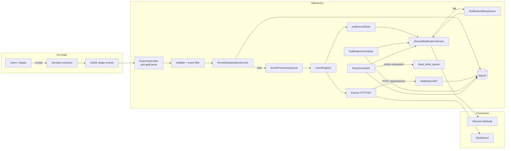
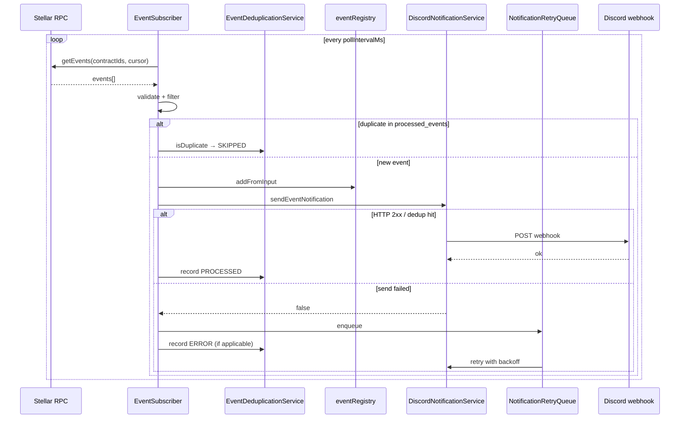
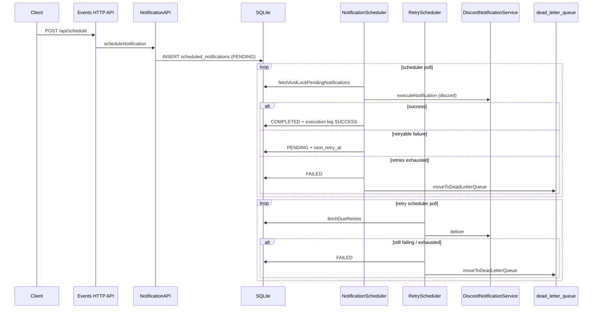

# Notification Processing Flow

> End-to-end path from a Stellar/Soroban contract event to delivery outcome in the Notify-Chain listener.

This guide describes **processing stages that exist in the current codebase**. It complements the broader lifecycle reference in [NOTIFICATION_LIFECYCLE.md](../NOTIFICATION_LIFECYCLE.md) and the retry-focused [NOTIFICATION_FAILURE_RECOVERY.md](../NOTIFICATION_FAILURE_RECOVERY.md).

Primary code lives under `listener/src/`.

---

## Table of Contents

1. [Scope](#scope)
2. [High-level architecture](#high-level-architecture)
3. [Two delivery pipelines](#two-delivery-pipelines)
4. [Real-time pipeline (blockchain → Discord)](#real-time-pipeline-blockchain--discord)
5. [Scheduled pipeline (API → SQLite → Discord)](#scheduled-pipeline-api--sqlite--discord)
6. [Detailed sequence diagrams](#detailed-sequence-diagrams)
7. [Asynchronous boundaries](#asynchronous-boundaries)
8. [Persistence vs transient state](#persistence-vs-transient-state)
9. [Idempotency and duplicates](#idempotency-and-duplicates)
10. [Failure, retry, and dead-letter behavior](#failure-retry-and-dead-letter-behavior)
11. [Troubleshooting undelivered notifications](#troubleshooting-undelivered-notifications)
12. [Source map](#source-map)
13. [Related documentation](#related-documentation)

---

## Scope

Stages that **are** implemented today:

| Stage | Real-time path | Scheduled path |
|-------|----------------|----------------|
| Blockchain event emission | Yes (on-chain) | Optional linkage via `eventId` / `contractAddress` fields |
| Event detection (RPC poll) | Yes — `EventSubscriber` | No |
| Parse / validate / filter | Yes | Payload / schedule validation on create + batch validate |
| Internal representation | In-memory `eventRegistry` | SQLite `scheduled_notifications` |
| Notification creation | Discord send (no schedule row) | `NotificationAPI.scheduleNotification()` |
| Queue / workers | `EventProcessingQueue`, `NotificationRetryQueue` | `NotificationScheduler`, `RetryScheduler`, `WorkerManager` |
| Routing | Preference gate → Discord only | `notificationType` (Discord implemented; email/webhook/sms throw “not yet implemented”) |
| Delivery provider | Discord webhook HTTP POST | Same Discord service for Discord type |
| Outcome / retry / DLQ | In-memory retry queue | Status machine + `dead_letter_queue` when retries exhausted |

Stages that are **not** invented here: multi-provider routers beyond Discord, message buses (Kafka/SQS), or automatic conversion of on-chain `NotificationScheduled` events into SQLite schedule rows.

---

## High-level architecture

---

## Two delivery pipelines

| Pipeline | Trigger | Durability | Entry code |
|----------|---------|------------|------------|
| **Real-time** | Contract events polled from Soroban RPC | Event dedup / cursors in SQLite; Discord retries mostly in-memory | `EventSubscriber` → optional queues → `DiscordNotificationService` |
| **Scheduled** | `POST /api/schedule` or `NotificationAPI.scheduleNotification()` | Full row lifecycle in SQLite + execution log + archive + DLQ | `NotificationScheduler` / `RetryScheduler` |

Both pipelines can deliver via Discord when configured. The dashboard primarily reads the **in-memory** `eventRegistry` through `GET /api/events` for the real-time feed.

---

## Real-time pipeline (blockchain → Discord)

Ordered stages in `EventSubscriber` (`listener/src/services/event-subscriber.ts`):

1. **Poll** — `poll()` sleeps `pollIntervalMs` (default **30000**), then `checkForEvents()`.
2. **Fetch** — per configured contract, `getContractEvents()` calls RPC `getEvents` (`limit: 100`, cursor or `startLedger: 1`).
3. **Filter** — `shouldProcessEvent()`:
   - `validateEventPayload()` — malformed events are logged and skipped
   - `getEventName()` + `matchesEventFilter()` — non-matching names are skipped
4. **Enqueue or process** — if `eventQueue` is configured, `EventProcessingQueue.enqueue()`; else `processEvent()` inline.
5. **Persistent dedup** — `EventDeduplicationService.isDuplicate()` against `processed_events`. Duplicates recorded as `SKIPPED` and return early.
6. **Registry ingest** — `eventRegistry.addFromInput(...)` (transient display model for the API).
7. **Preference gate** — `preferenceStore.isCategoryEnabled(userId, 'discord')` (`userId` from `contractConfig.userId` or `'global'`).
8. **Deliver** — `DiscordNotificationService.sendEventNotification()` (in-memory notification dedup + HTTP webhook).
9. **Retry queue** — if send returns `false` and `retryQueue` exists, `NotificationRetryQueue.enqueue(...)`.
10. **Record outcome** — `recordProcessedEvent(..., PROCESSED | ERROR)` when dedup service is present.
11. **Cursor** — polling cursor updated for the contract (when dedup/cursor persistence is wired).

RPC failures for **all** contracts in a cycle trigger reconnection with delay `reconnectDelayMs * attempt`, up to `maxReconnectAttempts` (defaults **5000** ms base, **5** attempts).

---

## Scheduled pipeline (API → SQLite → Discord)

1. **Create** — `POST /api/schedule` → `NotificationAPI.scheduleNotification()` → `ScheduledNotificationRepository.create()`  
   - Validates future `executeAt`, object `payload`, `targetRecipient`  
   - Optional API idempotency via `IdempotencyKeyService`  
   - Default row `max_retries` is **3**, default `priority` **5** (repository/API defaults)
2. **Wait** — row stays `PENDING` until `execute_at`.
3. **Lock & process** — `NotificationScheduler` polls (`SCHEDULER_POLL_INTERVAL_MS` default **10000**), `fetchAndLockPendingNotifications`, optional batch validation, `WorkerManager` job tracking.
4. **Execute** — Discord type calls `sendEventNotification`; other `notificationType` values are not implemented and fail.
5. **Complete or retry** — success → `COMPLETED` + execution log `SUCCESS`; failure → `markAsFailedOrRetry` (back to `PENDING` with `next_retry_at`, or `FAILED`).
6. **RetryScheduler** — picks due rows with `retry_count > 0`, exponential backoff (`RETRY_BASE_DELAY_MS` **5000**, multiplier **2**, max delay **3600000**, jitter unless disabled).
7. **Dead letter** — when marked failed after retries exhausted, `moveToDeadLetterQueue()` inserts into `dead_letter_queue`. Operators can inspect via `NotificationAPI.getDeadLetterQueue()` and requeue with `retryDeadLetterNotification()`.
8. **Archive / cleanup** — background `ArchiveService` / `CleanupService` move or purge aged rows per retention config.

---

## Detailed sequence diagrams

### Real-time success and failure

### Scheduled delivery with retry / DLQ

---

## Asynchronous boundaries

| Boundary | Sync or async | Notes |
|----------|---------------|-------|
| Contract invoke → ledger | On-chain | Listener is not in the transaction path |
| RPC poll loop | Async timer | Independent of HTTP API |
| `EventProcessingQueue` | Async worker | Optional; concurrency default **1** |
| Discord HTTP | Awaited per attempt | Failures do not roll back registry insert |
| `NotificationRetryQueue` | Async timer | In-memory; lost on process restart |
| HTTP `POST /api/schedule` | Sync insert | Delivery happens later via schedulers |
| `NotificationScheduler` / `RetryScheduler` | Async timers + DB locks | Survive restarts when SQLite is durable |
| Archive / cleanup / analytics persist | Background | Not on the critical delivery path |

---

## Persistence vs transient state

**Persisted (SQLite, default `./data/notifications.db`):**

- `processed_events`, `polling_cursors`
- `scheduled_notifications`, `notification_execution_log`
- `dead_letter_queue`
- `idempotency_keys`, archive tables, metrics snapshots, rate-limit / backpressure audit tables (as present in schema)

**Transient (process memory):**

- `eventRegistry` (dashboard event feed)
- `preferenceStore`
- `NotificationDeduplicator` window
- `EventProcessingQueue` / `NotificationRetryQueue` contents
- In-memory analytics window (until persist interval)

Restarting the listener drops transient queues and the in-memory registry; durable scheduled rows and processed-event fingerprints remain if the database file is intact.

---

## Idempotency and duplicates

| Layer | Mechanism | Location |
|-------|-----------|----------|
| Event processing queue | Fingerprint `contractAddress:event.id` while queued | `event-processing-queue.ts` |
| Persistent event dedup | SHA256 fingerprint in `processed_events`; reorg-aware | `event-deduplication-service.ts` |
| Discord notification dedup | In-memory window (default 60s / 10k entries) | `notification-deduplicator.ts` |
| Retry queue | Fingerprint including event name + tx hash | `notification-retry-queue.ts` |
| Schedule API | Optional idempotency keys (default TTL 24h) | `idempotency-key-service.ts` |

On duplicate detection in the real-time path, the event is **not** re-delivered; it is recorded as `SKIPPED` when the dedup service is active.

---

## Failure, retry, and dead-letter behavior

Only behaviors present in code:

| Failure | Behavior |
|---------|----------|
| Malformed RPC event | Skipped after `validateEventPayload` warning; not registered |
| Event name not in allow-list | Silent skip in filter |
| Persistent duplicate | `SKIPPED`; no Discord send |
| Discord category disabled | Event stays in registry; no send |
| Discord HTTP failure (real-time) | Optional `NotificationRetryQueue` with exponential backoff (defaults: base **5000** ms, multiplier **2**, max retries **5**, jitter on); after exhaustion, item is dropped from the in-memory queue (see retry queue logging) |
| Event queue processor failure | Retry with `EVENT_QUEUE_*` backoff (defaults: base **2000** ms, max retries **3**) |
| All RPC contracts fail in a poll | Reconnect backoff; stop after `MAX_RECONNECT_ATTEMPTS` |
| Schedule create validation failure | No DB row |
| Scheduled delivery failure | `markAsFailedOrRetry`; when retries remain → `PENDING` + `next_retry_at`; when exhausted → `FAILED` + **`dead_letter_queue`** |
| Non-Discord scheduled types | Execution throws “not yet implemented” → failure/retry/DLQ path |
| Provider unavailable | Same as HTTP / execution failure paths above |

Deep dive on retry knobs: [NOTIFICATION_FAILURE_RECOVERY.md](../NOTIFICATION_FAILURE_RECOVERY.md).

---

## Troubleshooting undelivered notifications

Use this checklist against the **actual** observability surfaces:

1. **Confirm the event was ingested**  
   - `GET /api/events` — is it in the in-memory registry?  
   - Logs: `Processing event` / `Skipping event: already processed`  
   - SQLite `processed_events` — status `PROCESSED`, `SKIPPED`, or `ERROR`

2. **Confirm Discord is configured**  
   - Both `DISCORD_WEBHOOK_URL` and `DISCORD_WEBHOOK_ID` must be set  
   - Preference store may disable the `discord` category for the contract `userId`

3. **Check delivery attempts**  
   - Listener logs around `DiscordNotificationService` / webhook status  
   - Real-time: retry queue metrics / exhaustion logs  
   - Scheduled: `notification_execution_log`, `GET /api/schedule/:id`, schedule stats endpoints

4. **Scheduled path specifically**  
   - Row still `PENDING` with future `execute_at`?  
   - `PROCESSING` stuck past lock timeout?  
   - `FAILED` → inspect `dead_letter_queue` via `NotificationAPI.getDeadLetterQueue()` / health report DLQ depth  
   - Requeue with `retryDeadLetterNotification` if appropriate

5. **Health endpoints**  
   - `GET /health`, `GET /api/status`  
   - `GET /api/notifications/health` (includes DLQ depth when repository is wired)  
   - `GET /api/indexing/health` for registry vs network tip lag

6. **Config mistakes**  
   - Empty `CONTRACT_ADDRESSES`, wrong RPC URL, CORS-only issues (dashboard fetch), or process restart clearing in-memory retry state

---

## Source map

| Stage | Files |
|-------|--------|
| Entry / wiring | `listener/src/index.ts`, `listener/src/config.ts` |
| Poll / process | `listener/src/services/event-subscriber.ts` |
| Validate / filter | `listener/src/utils/event-utils.ts` |
| Event queue | `listener/src/services/event-processing-queue.ts` |
| Event dedup | `listener/src/services/event-deduplication-service.ts` |
| Registry / preferences | `listener/src/store/event-registry.ts`, `preference-store.ts` |
| Discord delivery | `listener/src/services/discord-notification.ts`, `webhook-sender.ts` |
| Real-time retry | `listener/src/services/notification-retry-queue.ts` |
| HTTP API | `listener/src/api/events-server.ts` |
| Schedule API | `listener/src/services/notification-api.ts` |
| Schedulers | `listener/src/services/notification-scheduler.ts`, `retry-scheduler.ts` |
| Persistence / DLQ | `listener/src/services/scheduled-notification-repository.ts` |
| Workers | `listener/src/services/worker-manager.ts` |
| Archive / cleanup | `listener/src/services/archive-service.ts`, `cleanup-service.ts` |

---

## Related documentation

- [NOTIFICATION_LIFECYCLE.md](../NOTIFICATION_LIFECYCLE.md) — canonical lifecycle, ack, archival
- [NOTIFICATION_FAILURE_RECOVERY.md](../NOTIFICATION_FAILURE_RECOVERY.md) — retry configuration and monitoring
- [docs/notifications/lifecycle.md](notifications/lifecycle.md) — scheduled state machine deep dive
- [API_SEQUENCE_DIAGRAMS.md](../API_SEQUENCE_DIAGRAMS.md) — additional Mermaid sequences
- [CONTRACT_EVENT_REFERENCE.md](../CONTRACT_EVENT_REFERENCE.md) — on-chain event catalog
- [ENVIRONMENT_VARIABLES_AND_SECRETS.md](../ENVIRONMENT_VARIABLES_AND_SECRETS.md) — env reference

---

## Validation notes

Processing stages, diagrams, and failure behavior in this document were traced against `event-subscriber.ts`, queue/scheduler services, Discord delivery, `scheduled-notification-repository.ts` (including `dead_letter_queue`), and the events HTTP API. Mermaid diagrams intentionally omit components that are not wired into the production paths described above.
